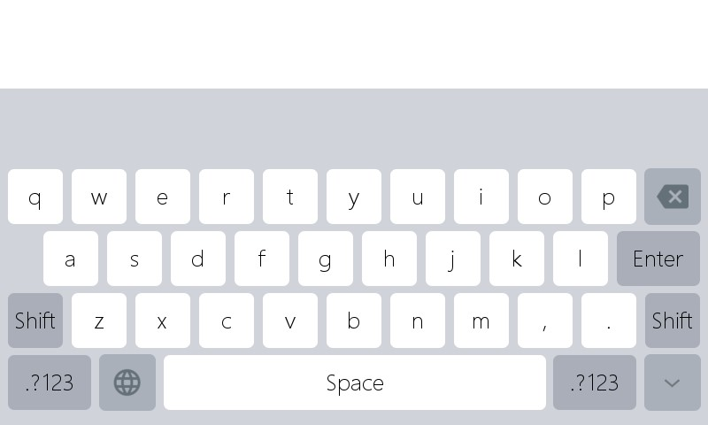

# 编辑/输入框
## 我需要数字键盘， 我需要用户手动输入中文，怎么办？
[如何添加编辑/输入框](#add_edit_text)

## <span id = "add_edit_text">如何添加编辑/输入框</span>
如果需要数字及中文输入，利用现有的`编辑/输入框`控件就可以快速实现。具体操作步骤如下：
1. 双击打开main.ftu文件
2. 在右侧控件集合中找到`编辑/输入框`控件
3. 鼠标左键点击`编辑/输入框`控件不放，然后将其拖拽到任意位置，松开左键，就能看到自动编辑/输入框的控件。
4. 当下载运行到机器上，点击`编辑/输入框`控件，会自动打开一个系统内置输入法或者数字键盘，这样就可以输入文字或数字了。
     

    内置拼音输入法 截图
    
  
      内置数字键盘输入  截图
      
  
5. 默认的`编辑/输入框`为白色，你可以在右侧的属性表里自定义外观样式。其中关于`编辑/输入框`的相关属性有如下几个：
  * **是否为密码框输入**  
    如果选择是，当模拟键盘输入时，正在键入的字符会显示为指定的`密码字符`，否则无变化
  * **密码字符**  
    如果`是否为密码输入`选择`是`,正在键入的字符会显示为指定的`密码字符`，否则无变化
  * **文本类型**  
    该属性有两个选项，分别是  
       * 全文本  
      表示可以输入中英文及数字，不受限制。
       * 仅数字  
      表示只能输入数字，其他受限。
  * **提示文本**  
    当模拟键盘中内容为空时，会自动显示提示文本。
  * **提示文本颜色**  
    当模拟键盘中内容为空时，会自动显示提示文本，该文本颜色为指定的颜色。
### 如何得到模拟键盘的输入内容？
当成功创建了`编辑/输入框`，选择 **编译FlyThings** ，打开工程目录下的`jni/logic/****Logic.cc`文件(\*\*\*\*表示UI文件名 )，找到自动生成的函数  
```c++
static void onEditTextChanged_XXXX(const std::string &text) {
	       //LOGD("当前输入的内容为 %s \n", text.c_str());
}
```
当模拟键盘输入内容的时候，系统会自动调用该函数，参数`text`就是当前模拟键盘上的完整字符串。（`XXXX`表示控件ID名）  
[了解更多控件的关联函数](relation_function)
