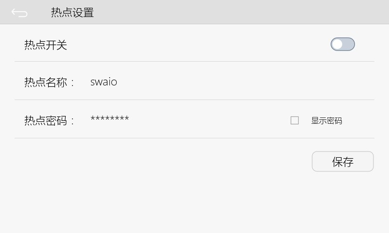

除了开发人员自己定制的界面外，我们系统也内置了几个常用的界面，如插卡升级时出现的界面就属于内置界面之一；


另外，还有系统设置界面，打开方式：
```c++
EASYUICONTEXT->openActivity("ZKSettingActivity");
```


其中每一项点击进去后又是新的内置界面，打开网络设置：
```c++
EASYUICONTEXT->openActivity("NetSettingActivity");
```


打开WIFI设置：
```c++
EASYUICONTEXT->openActivity("WifiSettingActivity");
```


如果目标机器支持wifi，打开右上角开关，界面上会显示搜索到的wifi信息；

打开热点设置界面：
```c++
EASYUICONTEXT->openActivity("SoftApSettingActivity");
```


回到刚刚的系统设置界面，我们再点击打开语言设置界面：
```c++
EASYUICONTEXT->openActivity("LanguageSettingActivity");
```


触摸校准界面：
```c++
EASYUICONTEXT->openActivity("TouchCalibrationActivity");
```


开发者选项界面：
```c++
EASYUICONTEXT->openActivity("DeveloperSettingActivity");
```


目前只有ADB的调试开关选项。
