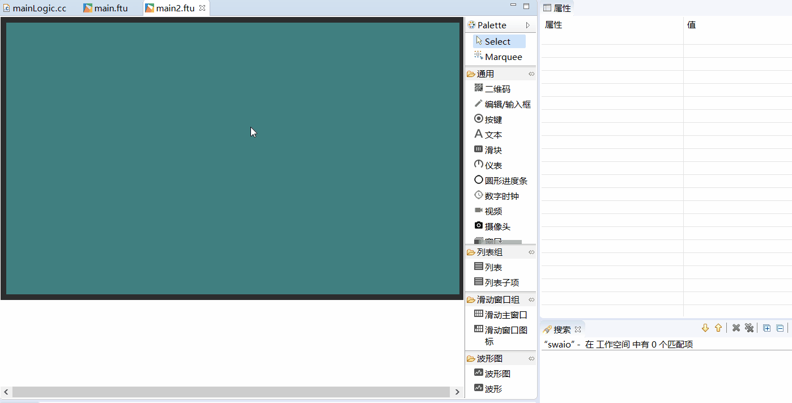

# 列表控件
## 功能
列表按键经常用于一个页面无法展示完成所有信息的时候使用，同时每个单元信息中存在一些一致的属性分类

## 场景
WiFi列表，设备列表，表格信息

# 具体如何使用
1. 打开UI文件，创建一个列表控件,再添加两个列表子项控件到列表中 然后你就能直观的看到列表的外观样式。 具体操作如下：  

2. 选中列表，可以看到它有如下属性   
    
 
 每条属性你可以尝试修改，然后下载程序到机器中查看具体变化。  
3. 现在转到大纲视图    

 
 
 可以看到列表下默认生成了一个 **Item**节点，它表示列表的一行或者一列， 在**Item**里包含我们添加的两个 **ListSub** 节点。  
 你可以点击选中各个节点，查看它们各自的属性，以及在预览图上可以看到它们作用的范围。  
 **注意：每一个列表控件最多可以添加 5 个列表子项。**
 
 **Item** 和 **列表子项** 控件的属性与 **按键**控件类似。
 你可以分别修改它们的属性，调整样式。我这边修改后的结果如下：  
 
   
 
## 代码操作
 在UI文件中，我们只能调整列表的样式外观，列表中具体显示的内容还需要我们通过代码控制。
 这部分代码，都可以在编译后生成的关联函数中完成。
 具体列表的关联函数讲解可以参考[列表关联函数介绍](relation_function#list)
 
## 样例代码
完整列表控件的使用，参考[样例代码](https://github.com/zkswe/Z11SDemoCode/archive/master.zip)    

