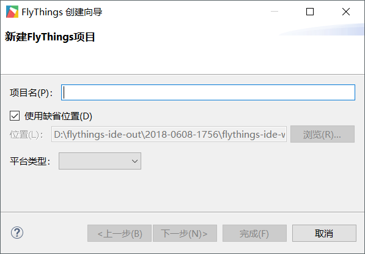
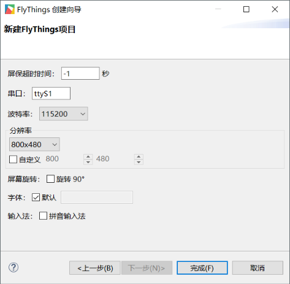

# 如何新建FlyThings项目
新建一个FlyThings项目十分简单。具体步骤如下：  
1. 在编辑器顶部的菜单栏中，依次选择 **文件 -> 新建 -> FlyThings项目**   

     

2. 上一步选择完成后，将弹出 **FlyThings创建向导** 提示框。  
  
     
   按要求填写新建项目相关的参数。  这些参数分别是：
 * **项目名**  
  项目的名称；可以是字母、数字的组合，不能出现中文及空格。
  * **位置**  
  项目的存储路径；同样不推荐出现中文，防止编译异常。
  * **平台类型**  
  根据购买的串口屏选择相应的平台，目前有  
    - **Z11S**  
    - **Z6S**  
    
   规范填写如上必须参数后，你可以直接选择 **完成** ，来快速完成创建。但是现在，我们选择 **下一步** 来自定义更多的参数。
3. 点击下一步之后，我们将看到更多的参数定义  
  
     
 ## 项目各个属性的含义及作用：  
 * **屏保超时时间**  
   FlyThings系统提供屏保的功能。如果在指定的时间内，串口屏没有任何触摸操作，或者你没有通过代码重置屏保计时，那么，系统将自动进入屏保。  
  如果时间为 ** -1 **秒， 表示禁止屏保功能。
 * **串口**  
  指定通讯串口，一般情况下不需要修改。
 * **波特率**   
  指定通讯串口的波特率 
 * **分辨率**  
  以像素为单位，指定屏幕的宽高
 * **屏幕旋转**  
  针对某些屏幕坐标轴方向不同，可勾选该选项，将显示内容旋转90°，达到正常显示。
 * **字体**  
  FlyThings支持自定义字体，如果你不满意默认字体，可取消默认，再选择你的字体文件。
 * **输入法**  
  如果你有中文输入的需求，可以勾选它， 配合 **[编辑输入框](edittext)** 控件，就可以解决中文输入了。      
  
  以上属性后续都可以再次修改，所以不必过分担心填写错误。([如何修改已有项目的属性]())  
  属性都填写确认后，点击 ** 完成 ** 结束创建，创建过程会花费些许时间，耐心等待。  
  
4. 项目创建完成后，你应该先了解 [FlyThings 项目代码结构介绍](project_structure#project_structure)
