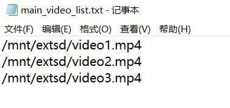

# 视频
FlyThings还提供了视频播放的控件。  

# 如何使用  
1. 首先，创建一个 **视频** 控件，默认背景色为黑色。
2. 查看 **视频** 的属性表  

     

   其中，有个属性为 **是否为轮播视频类型**   
如果选择 **是** ，那么每次进入这个UI界面时，会自动读取SD卡目录下的配置文件，循环播放配置文件中指定的视频。 退出页面自动停止播放。  这个属性非常适合仅需要播放视频、且不存在用户干预播放的场景，比如轮播广告机、自动播放一段短视频等。  
如果选择 **否** ，仅仅只会创建一个视频的渲染区域，除此以外没有其他操作。那么，你就需要自己去操作视频播放了。

## 视频配置文件  
上面说到，如果是**视频轮播类型**，会自动读取视频配置文件。  你需要自行创建它。  
这个配置文件需要位于SD卡根目录下，文件名是 **XXXX_video_list.txt** 
XXXX 表示对应的UI文件前缀名。例如：  我在 **main.ftu** 中添加了一个视频控件，那么，对应的配置文件名为 **main_video_list.txt**  
配置文件以行为单位， 每行为视频文件的绝对路径，如果视频文件也位于SD卡根目录，那么直接填写 `/mnt/extsd/` 加上 视频文件名即可。   

**注意： 防止编码问题导致视频文件读取失败，请尽量使用英文命名视频文件。**

## 完整视频播放器的实现
如果你对视频播放有更高的要求，需要控制播放/暂停、拖动视频进度条等。    
可以参考[完整视频播放器样例（待续）]()

## 样例代码
在该样例中， 实现了视频的循环播放，以及调整视频音量。   
具体实现，参考[样例代码](demo_download#demo_download)  

 