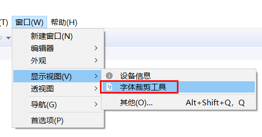
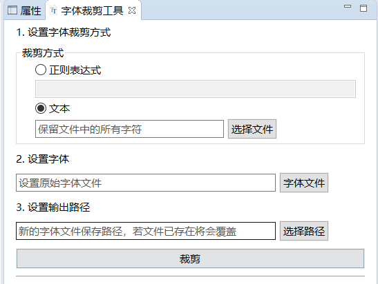
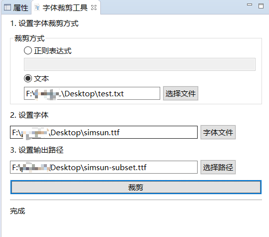

### 字体裁剪

在项目中，可能会使用自定义字体，但是动辄上10M的完整字体并不适合在项目上使用。
并且，通常我们只用到字体中的一小部分，将不需要的字符裁剪掉，可以大大节省字体的空间消耗，也能加快屏的启动速度。

### 字体裁剪工具的使用
在开发工具的菜单栏中，可以找到字体裁剪工具。  
  
  ，

  

1. 首先选择字体裁剪的方式。 这一步目的是要确定保留字体中的哪些字符。  
   * 正则表达式   
     支持java正则表达式，   例如  `\d` 则表示所有数字
   * 指定文本  
     指定一个文本文件，**保证文件编码为UTF-8** ，文件内容中的所有文字即表示需要保留的文字。 （推荐该方式： 简单、直观）
2.  设置字体  
    指定完整字体的路径。  
3.  设置输出路径  
    指定字体裁剪后，新字体的保存路径。如果文件已存在，将会造成覆盖。
4. 以上参数设置完成后，点击 ** 裁剪** 
5. 如果提示完成， 则裁剪成功，可以在输出路径中看到新生成的字体文件。可以发现，裁剪后的字体文件小于完整的字体。

### 示例
新建一个txt文件，文件内容仅 “你好” 两个字，**保存编码为UTF-8** 。设置好参数后，裁剪，最终生成的 ttf 文件大小在10KB以内。  
 裁剪后的字体可以在[在线字体编辑器](http://fontstore.baidu.com/static/editor/index.html)中校验包含哪些字符。 

