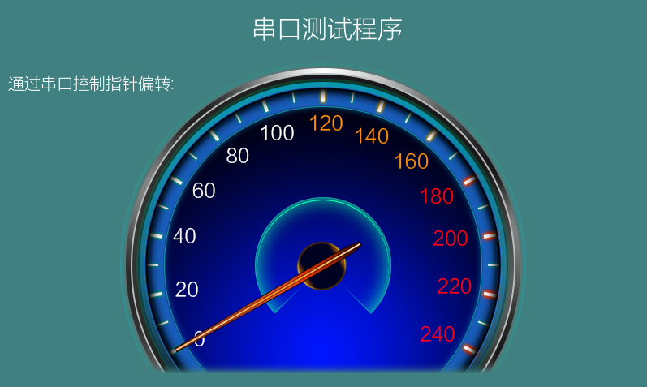

# 串口通讯协议
## 视频讲解
<iframe
    width="800"
    height="450"
    src="https://player.youku.com/embed/XMzIzMzA5NTQ3Ng?client_id=70425dd755d80061&password=undefined&autoplay=false"
    frameborder="0"
    allowfullscreen>
</iframe>
## 代码框架


软件APP部分分为两层
* uart协议解析和封装的串口HAL层
	* UartContext：串口的实体控制层，提供串口的开关，发送，接收接口
	* ProtocolData：定义通讯的数据结构体，用于保存通讯协议转化出来的实际变量；
	* ProtocolSender：完成数据发送的封装；
	* ProtocolParser：完成数据的协议解析部分，然后将解析好的数据放到ProtocolData的数据结构中；同时管理了应用监听串口数据变化的回调接口；
* APP应用接口层
	* 通过ProtocolParser提供的接口注册串口数据接收监听获取串口更新出来的ProtocolData。
	* 通过ProtocolSender提供的接口往MCU发送指令信息

## 协议接收部分使用和修改方法
### 通讯协议格式修改
这里我们举一个比较常见的通讯协议例子：

| 协议头（2字节） | 命令（2字节） | 数据长度（1字节） | 数据（N） | 校验（1字节 可选) |
| --- | --- | --- | --- | --- |
| 0xFF55 | Cmd | len | data | checksum |

CommDef.h 文件中定义了同步帧头信息及最小数据包大小信息：
```c++
// 需要打印协议数据时，打开以下宏
//#define DEBUG_PRO_DATA

// 支持checksum校验，打开以下宏
//#define PRO_SUPPORT_CHECK_SUM

/* SynchFrame CmdID  DataLen Data CheckSum (可选) */
/*     2Byte  2Byte   1Byte	N Byte  1Byte */
// 有CheckSum情况下最小长度: 2 + 2 + 1 + 1 = 6
// 无CheckSum情况下最小长度: 2 + 2 + 1 = 5

#ifdef PRO_SUPPORT_CHECK_SUM
#define DATA_PACKAGE_MIN_LEN		6
#else
#define DATA_PACKAGE_MIN_LEN		5
#endif

// 同步帧头
#define CMD_HEAD1	0xFF
#define CMD_HEAD2	0x55
```

ProtocolParser.cpp 文件，配置文件命令格式：
```c++
/**
 * 功能：解析协议
 * 参数：pData 协议数据，len 数据长度
 * 返回值：实际解析协议的长度
 */
int parseProtocol(const BYTE *pData, UINT len) {
	UINT remainLen = len;	// 剩余数据长度
	UINT dataLen;	// 数据包长度
	UINT frameLen;	// 帧长度

	/**
	 * 以下部分需要根据协议格式进行相应的修改，解析出每一帧的数据
	 */
	while (remainLen >= DATA_PACKAGE_MIN_LEN) {
		// 找到一帧数据的数据头
		while ((remainLen >= 2) && ((pData[0] != CMD_HEAD1) || (pData[1] != CMD_HEAD2))) {
			pData++;
			remainLen--;
			continue;
		}

		if (remainLen < DATA_PACKAGE_MIN_LEN) {
			break;
		}

		dataLen = pData[4];
		frameLen = dataLen + DATA_PACKAGE_MIN_LEN;
		if (frameLen > remainLen) {
			// 数据内容不全
			break;
		}

		// 打印一帧数据，需要时在CommDef.h文件中打开DEBUG_PRO_DATA宏
#ifdef DEBUG_PRO_DATA
		for (int i = 0; i < frameLen; ++i) {
			LOGD("%x ", pData[i]);
		}
		LOGD("\n");
#endif

		// 支持checksum校验，需要时在CommDef.h文件中打开PRO_SUPPORT_CHECK_SUM宏
#ifdef PRO_SUPPORT_CHECK_SUM
		// 检测校验码
		if (getCheckSum(pData, frameLen - 1) == pData[frameLen - 1]) {
			// 解析一帧数据
			procParse(pData, frameLen);
		} else {
			LOGE("CheckSum error!!!!!!\n");
		}
#else
		// 解析一帧数据
		procParse(pData, frameLen);
#endif

		pData += frameLen;
		remainLen -= frameLen;
	}

	return len - remainLen;
}
```
上面的解析流程有点复杂，下面我们先给出一张图，再来分析可能会容易理解一些；一包数据可能包含0到多帧数据，下面这张图里，我们标出来有3帧数据，另外还有一帧数据不全，还少5个数据，不完整的那一帧数据将会拼接到下一包数据里


* 协议头需要修改

```c++
// 1.修改协议头部分的定义，如果协议头长度有变化，则要注意修改协议头判断部分语句。
#define CMD_HEAD1	0xFF
#define CMD_HEAD2	0x55

// 2.协议头长度变化的时候需要修改这里。
while ((mDataBufLen >= 2) && ((pData[0] != CMD_HEAD1) || (pData[1] != CMD_HEAD2)))
```

* 协议长度的位置或者长度计算方式发生变化的修改

```c++
// 这里的pData[4] 代表的是第5个数据是长度的字节，如果变化了在这里修改一下。
dataLen = pData[4];
// 帧长度一般是数据长度加上头尾长度。如果协议中传的长度计算方式发生变化修改这个部分。
frameLen = dataLen + DATA_PACKAGE_MIN_LEN;
```

* 校验发生变化的情况

```c++
/**
 * 默认我们是关闭checksum校验的，如果需要支持checksum校验，在CommDef.h文件中打开PRO_SUPPORT_CHECK_SUM宏
 * 当校验不一样的时候需要修改校验方法，
 * 1.校验内容变化修改这个位置
 *     if (getCheckSum(pData, frameLen - 1) == pData[frameLen - 1])
 * 2.校验计算公式变化修改 getCheckSum函数里边的内容
 */

/**
 * 获取校验码
 */
BYTE getCheckSum(const BYTE *pData, int len) {
	int sum = 0;
	for (int i = 0; i < len; ++i) {
		sum += pData[i];
	}

	return (BYTE) (~sum + 1);
}
```

* 当完成一帧数据的接收后程序会调用procParse 解析

```c++
	// 支持checksum校验，需要时在CommDef.h文件中打开PRO_SUPPORT_CHECK_SUM宏
#ifdef PRO_SUPPORT_CHECK_SUM
	// 检测校验码
	if (getCheckSum(pData, frameLen - 1) == pData[frameLen - 1]) {
		// 解析一帧数据
		procParse(pData, frameLen);
	} else {
		LOGE("CheckSum error!!!!!!\n");
	}
#else
	// 解析一帧数据
	procParse(pData, frameLen);
#endif
```

### 通讯协议数据怎么和UI控件对接
继续前面的协议框架我们进入到procParse的解析部分。
这里重点的代码是：ProtocolParser.cpp
打开文件然后找到void procParse(const BYTE *pData, UINT len)
```c++
/*
 * 协议解析
 * 输入参数:
 *     pData: 一帧数据的起始地址
 *     len: 帧数据的长度
 */
void procParse(const BYTE *pData, UINT len) {
	/*
	 * 解析Cmd值获取数据赋值到sProtocolData结构体中
     */
	switch (MAKEWORD(pData[2], pData[3])) {
	case CMDID_POWER:
		sProtocolData.power = pData[5];
		LOGD("power status:%d",sProtocolData.power);
		break;
	}
	notifyProtocolDataUpdate(sProtocolData);
}

```
以上 `MAKEWORD(pData[2], pData[3])` 在我们的协议例子中表示Cmd值；
当数据解析完成后通过`notifyProtocolDataUpdate` 通知到页面UI更新，这个部分请参照后面的UI更新部分

* 数据结构

上面的协议解析到了sProtocolData 结构体中，sProtocolData 是一个静态的变量，用于保存MCU（或者其他设备）串口发送过来的数据值。
这个数据结构在ProtocolData.h文件中。这里可以添加整个项目里面需要使用到的通讯变量
```c++
typedef struct {
	// 可以在这里面添加协议的数据变量
	BYTE power;
} SProtocolData;

```

* UI更新

UI界面在工具生成Activity.cpp的时候就已经完成了registerProtocolDataUpdateListener ，也就是说当数据更新的时候logic里面页面程序就会收到数据。

```c++
static void onProtocolDataUpdate(const SProtocolData &data) {
    // 串口数据回调接口
	if (mProtocolData.power != data.power) {
		mProtocolData.power = data.power;
	}

	if (mProtocolData.eRunMode != data.eRunMode) {
		mProtocolData.eRunMode = data.eRunMode;
		mbtn_autoPtr->setSelected(mProtocolData.eRunMode == E_RUN_MODE_MANUAL);
		if (mProtocolData.eRunMode != E_RUN_MODE_MANUAL) {
			mbtn_external_windPtr->setText(mProtocolData.externalWindSpeedLevel);
			mbtn_internal_windPtr->setText(mProtocolData.internalWindSpeedLevel);
		}
	}
    ...
}

```
在代码里面我们看到一个变量 mProtocolData，这是一个页面里面的static 的变量。在onUI_init()的时候会初始化。
如：
```c++
static SProtocolData mProtocolData;
static void onUI_init() {
	//Tips :添加 UI初始化的显示代码到这里,如:mText1->setText("123");
	mProtocolData = getProtocolData(); // 初始化串口数据的结构体。
	// 开始初始化页面的UI显示
}

```

## 串口数据发送
打开ProtocolSender.cpp
当APP层需要发送数据给MCU（或其他设备）的时候直接调用sendProtocol 就可以了。
具体的协议封装由sendProtocol方法完成。用户可以根据自己的协议要求修改这个部分的代码。
```c++
/**
 * 需要根据协议格式进行拼接，以下只是个模板
 */
bool sendProtocol(const UINT16 cmdID, const BYTE *pData, BYTE len) {
	BYTE dataBuf[256];

	dataBuf[0] = CMD_HEAD1;
	dataBuf[1] = CMD_HEAD2;			// 同步帧头

	dataBuf[2] = HIBYTE(cmdID);
	dataBuf[3] = LOBYTE(cmdID);		// 命令字节

	dataBuf[4] = len;

	UINT frameLen = 5;

	// 数据
	for (int i = 0; i < len; ++i) {
		dataBuf[frameLen] = pData[i];
		frameLen++;
	}

#ifdef PRO_SUPPORT_CHECK_SUM
	// 校验码
	dataBuf[frameLen] = getCheckSum(dataBuf, frameLen);
	frameLen++;
#endif

	return UARTCONTEXT->send(dataBuf, frameLen);
}
```
当界面上有个按键按下的时候可以操作：
```c++
BYTE mode[] = { 0x01, 0x02, 0x03, 0x04 };
sendProtocol(0x01, mode, 4);
```

# 演示样例讲解
通过上面的讲解，可能看的也是云里雾里的，这里我们先总结一下，串口通讯主要有以下4点内容：
1. 接收数据
2. 解析数据
3. 展示数据
4. 发送数据

其中 **解析数据** 部分较为复杂，需要根据具体的通讯协议做相应的改动，这里我们还是以上面的通讯协议为例，实现自己的一个简单的通讯程序；完整代码见 [样例代码](demo_download#demo_download) 里的 `UartDemo` 工程；<br/>
我们最终要实现的效果是，通过串口发送指令来控制显示屏上的仪表指针旋转，UI效果图如下：

   

1). 重温一下上面介绍的协议格式，这里我们新增自己的协议指令**CMDID_ANGLE**对应的值为**0x0001**：

| 协议头（2字节） | 命令（2字节） | 数据长度（1字节） | 数据（N） | 校验（1字节 可选) |
| --- | --- | --- | --- | --- |
| 0xFF55 | 0x0001（见以下`CMDID_ANGLE`） | 1 | angle | checksum |

协议数据结构体里我们新增1变量，见 `ProtocolData.h`:

```c++
/******************** CmdID ***********************/
#define CMDID_POWER			0x0
#define CMDID_ANGLE			0x1	// 新增ID
/**************************************************/

typedef struct {
	BYTE power;
	BYTE angle;	// 新增变量，用于保存指针角度值
} SProtocolData;
```
2). 由于我们使用的还是上面定义的协议格式，所以这里协议解析的部分我们不需要做任何改动，只需在`procParse`中处理对应的CmdID值即可：

```c++
/**
 * 解析每一帧数据
 */
static void procParse(const BYTE *pData, UINT len) {
	// CmdID
	switch (MAKEWORD(pData[3], pData[2])) {
	case CMDID_POWER:
		sProtocolData.power = pData[5];
		break;

	case CMDID_ANGLE:	// 新增部分，保存角度值
		sProtocolData.angle = pData[5];
		break;
	}

	// 通知协议数据更新
	notifyProtocolDataUpdate(sProtocolData);
}
```
3). 我们再来看界面接收到协议数据的回调接口，见 logic/mainLogic.cc：

```c++
static void onProtocolDataUpdate(const SProtocolData &data) {
	// 串口数据回调接口

	// 设置仪表指针旋转角度
	mPointer1Ptr->setTargetAngle(data.angle);
}
```
完成以上流程后，接下来我们只需要通过MCU向屏发送相应的指令就可以看到仪表指针的旋转了；为了简单起见，我们这个程序里不做checksum校验，协议数据如下：
```c++
   帧头       CmdID    数据长度    角度值
0xFF 0x55   0x00 0x01   0x01     angle
```
我们可以在CommDef.h文件中打开`DEBUG_PRO_DATA`宏，打印接收到的协议数据：


到此，串口的 **接收数据** ---> **解析数据** ---> **展示数据** 就算完成了； <br/><br/>
4). 最后我们再来模拟一下串口**发送数据**；这里，我们给出的程序里，开启了一个定时器，2s模拟一次数据发送：

```c++
static bool onUI_Timer(int id) {
	// 模拟发送串口数据
	BYTE data = rand() % 200;
	sendProtocol(CMDID_ANGLE, &data, 1);

	return true;
}
```
以上代码其实就是模拟设置角度值，我们可以通过短接屏上通讯串口的TX和RX，实现**自发自收**，也是可以看到仪表指针旋转的； <br/><br/>
到此，我们的串口演示程序就介绍完了，开发人员可以先把演示程序编译烧录到机器里看一下效果，然后再在这基础之上增加一些协议，熟悉这整个通讯流程。
